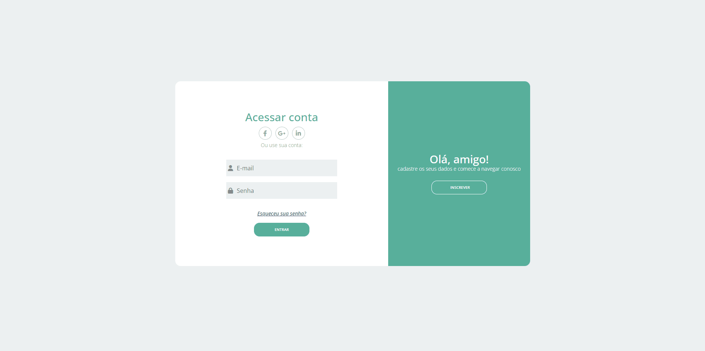

# Cadastro e Login
<h1>
    
</h1>

# Indice

- [Sobre](#-sobre)
- [Tecnologias utilizadas](#-tecnologias-utilizadas)
- [Como baixar o projeto](#-como-baixar-o-projeto)

## 🔖&nbsp; Sobre

O projeto **Cadastro e Login** é uma aplicação front-end para cadastro, autenticação e CRUD do usuário via API REST simulado com JSON-SERVER, foi desenvolvida com o objetivo de aprimorar meus conhecimentos no framework Angular.

---

## 🚀 Tecnologias utilizadas

O projeto foi desenvolvido utilizando as seguintes tecnologias:

- [HTML](https://developer.mozilla.org/pt-BR/docs/Web/HTML)
- [JavaScript](https://developer.mozilla.org/pt-BR/docs/Web/JavaScript)
- [TypeScript](https://www.typescriptlang.org/)
- [Angular](https://angular.io/)

---

## 🗂 Como baixar o projeto

```bash
    # Clonar o repositório
    $ git clone https://github.com/KellyVasconcellos/cadastro-login-angular.git
    # Entrar no diretório
    $ cd cadastro-login-angular
```

---

Desenvolvido 💜 por Kelly Vasconcellos
